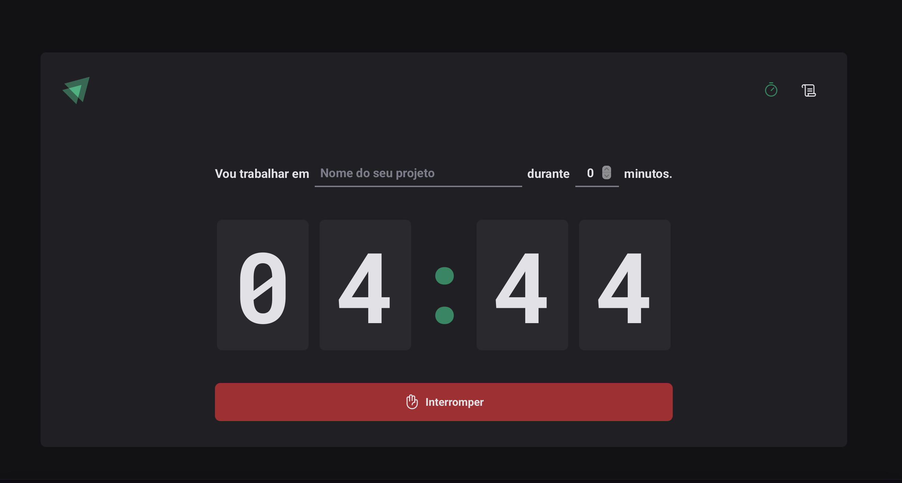
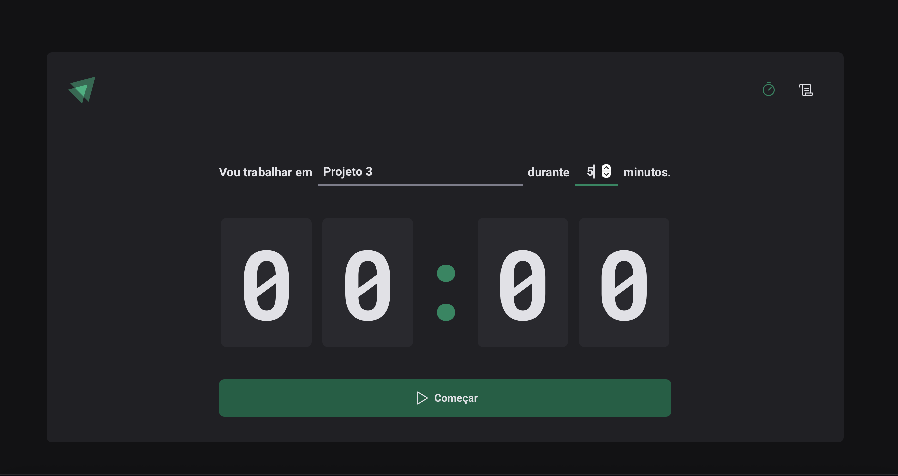
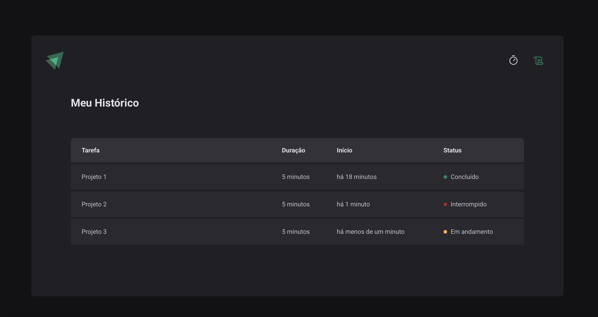

# Ignite Timer

Ignite Timer é uma aplicação desenvolvida durante o módulo Criando SPAs com ReactJS e TypeScript da Rocketseat. Seu objetivo é auxiliar no gerenciamento de ciclos de estudo ou trabalho, implementando conceitos fundamentais do React moderno.



## ✨ Funcionalidades

- Cadastro de ciclos com nome e tempo desejado
- Temporizador regressivo (countdown)
- Histórico com status de cada ciclo (concluído, interrompido, em andamento)
- Armazenamento persistente dos ciclos usando `localStorage`




## 🛠️ Tecnologias e Conceitos Aplicados

- **React + TypeScript**
- **Styled Components** para estilização com temas
- **React Router** para roteamento entre páginas
- **Context API + useReducer** para gerenciamento global de estado
- **Local Storage** para persistência de dados
- **Boas práticas de componentização e reatividade**

## 📄 Estrutura de Páginas

- **Home:** formulário para criação de novos ciclos + countdown do ciclo atual
- **Histórico:** lista dos ciclos registrados com status e horários

## 🚀 Como executar
```bash
# Clone o repositório
git clone https://github.com/seuusuario/ignite-timer.git
cd ignite-timer

# Instale as dependências
npm install

# Inicie o servidor de desenvolvimento
npm run dev
```

- Acesse http://localhost:5173 no seu navegador.

Feito com 💙 durante os estudos na Rocketseat 🚀